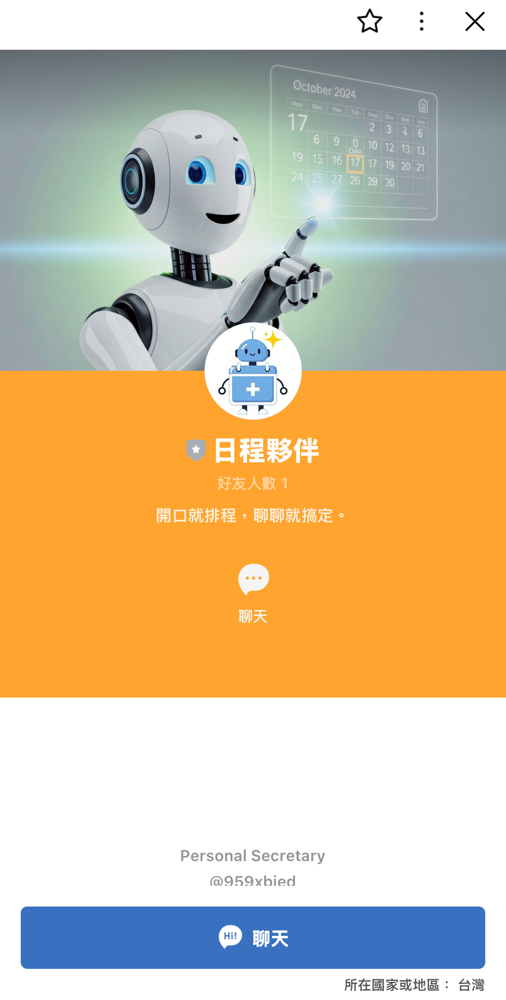
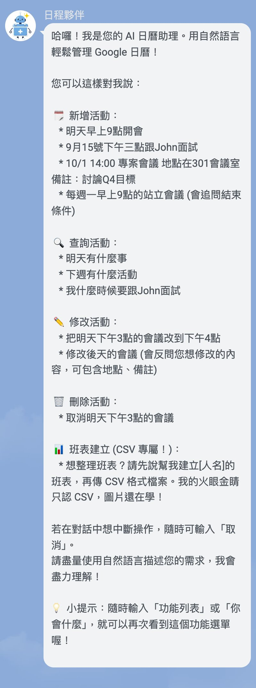
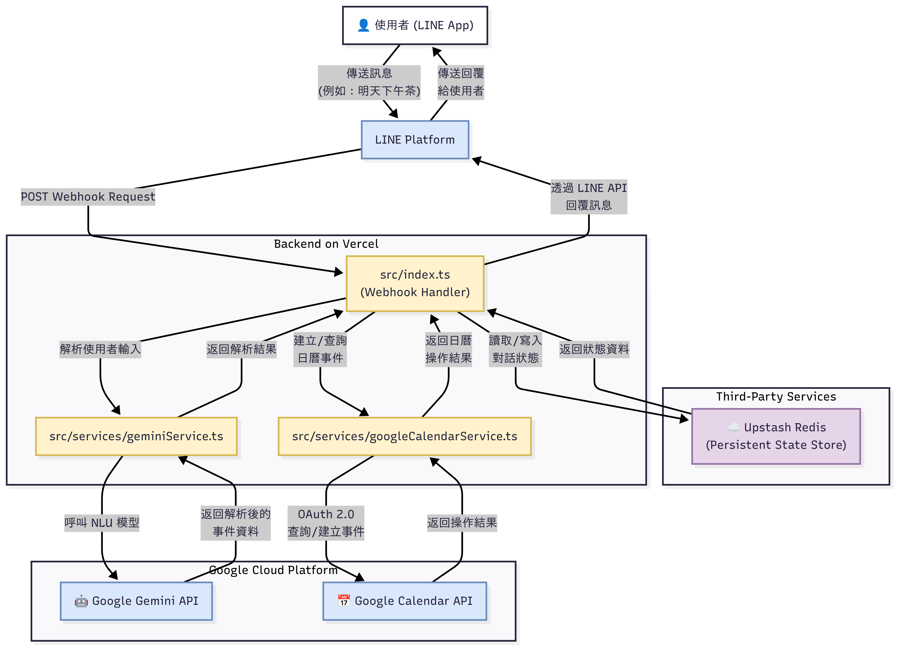

# LINE Bot AI 日曆助手

[](https://opensource.org/licenses/MIT)
[](CODE_OF_CONDUCT.md)


[](https://vercel.com/new/git/external?repository-url=https%3A%2F%2Fgithub.com%2Fyour-repo%2Fline-gemini-calendar-bot)







## 專案概觀

這是一個對話式 AI 助手，作為 LINE Bot 運作。其主要目的是幫助使用者透過自然語言建立 Google 日曆事件。該 Bot 使用 Node.js 和 TypeScript 構建，並設計用於 Vercel 上的無伺服器部署。

本 Bot 的一個關鍵功能是處理多輪對話的能力。如果使用者提供不完整的資訊（例如，沒有標題的時間，或沒有結束條件的重複事件），Bot 將會提出後續問題以收集必要的詳細資訊，然後再建立事件。這種有狀態的互動由 Upstash Redis 管理，實現跨無伺服器函式調用的持久化。

## 核心功能介紹

本 LINE Bot AI 日曆助手提供以下核心功能，旨在簡化您的日曆管理：

*   **自然語言事件建立**：使用者可以透過日常對話，以自然語言描述事件，Bot 將自動解析並建立 Google 日曆事件。
*   **智慧多輪對話**：當使用者提供的資訊不完整時，Bot 會主動提問，引導使用者補齊所有必要細節，確保事件資訊的完整性。
*   **重複事件管理**：支援建立重複性日曆事件，並能理解複雜的重複規則，如「每週二下午三點」或「每月第一個星期一」。
*   **事件重複預防**：在建立新事件前，Bot 會自動檢查 Google 日曆中是否存在相同標題和時間的事件，避免重複建立。
*   **靈活的活動修改**：使用者不僅能修改時間或標題，還能透過自然語言直觀地新增或更新活動的「地點」和「備註」。同時，我們優化了修改時的互動流程與提示文字，讓體驗更順暢自然。
*   **友善的互動介面**：透過 LINE 的按鈕模板 (ButtonsTemplate) 提供清晰的確認選項，並在事件建立後提供人類可讀的重複規則摘要，提升使用者體驗。

## 核心技術

*   **後端**：Node.js, Express.js, TypeScript
*   **AI 模型**：Google Gemini API (可透過 `GEMINI_MODEL` 環境變數配置，預設：`gemini-2.5-flash`)，用於自然語言理解 (NLU)，包括解析事件詳細資訊、重複規則，以及將規則翻譯成人類可讀的文字。
*   **日曆整合**：Google Calendar API (透過 `googleapis` 函式庫) 與 OAuth 2.0。
*   **訊息平台**：LINE Messaging API (透過 `@line/bot-sdk`)。
*   **部署**：Vercel (無伺服器函式)。
*   **開發**：`ts-node` 和 `nodemon` 用於本地開發。

## 架構



*   應用程式的入口點是 `src/index.ts`，它設定了一個 Express 伺服器作為 LINE Messaging API 的 Webhook。
*   業務邏輯分離到 `src/services/` 目錄中的服務：
    *   `geminiService.ts`：處理與 Gemini API 的所有互動。它包含多個專門的提示，用於解析初始命令、處理重複結束條件，以及翻譯 RRULE。
    *   `googleCalendarService.ts`：管理與 Google Calendar API 的所有互動，包括身份驗證、檢查重複事件以及建立新事件。
*   自訂錯誤類型 `DuplicateEventError` 用於當已存在相同事件時的特定流程控制。
*   對話狀態透過 Upstash Redis 進行管理，實現跨無伺服器函式調用的持久化。

## 開發慣例

*   **有狀態對話**：Bot 透過將使用者狀態儲存在 Upstash Redis 中來處理多輪對話。狀態包括步驟 (`awaiting_event_title`, `awaiting_recurrence_end_condition`) 和部分事件資料。這允許 Bot 提出澄清問題。
*   **服務導向結構**：邏輯模組化為服務 (`geminiService`, `googleCalendarService`)，以保持主 Webhook 處理程式 (`index.ts`) 的整潔，並專注於路由和狀態管理。
*   **自訂錯誤處理**：`DuplicateEventError` 用於在使用者嘗試建立已存在的事件時控制應用程式流程，允許發送特定的、使用者友好的訊息。
*   **重複預防**：在建立事件之前，`googleCalendarService` 會搜尋具有相同標題和時間的現有事件，以防止重複。
*   **使用者友善的回覆**：Bot 使用 LINE 的 `ButtonsTemplate` 進行確認，並提供詳細的成功訊息，包括任何重複規則的人類可讀摘要。

## 快速開始 / 安裝指南

要設定並運行此 LINE Bot AI 日曆助手，請參閱我們的詳細 [設定指南](./SETUP.md)。該指南將引導您完成所有必要的 API 金鑰申請、環境變數配置以及本地開發和部署步驟。

## 社群與支援

如果您在打造自己的私人日曆助理時遇到任何困難，或有任何疑問，歡迎透過以下方式聯繫我：

*   **Email**: s0974092@gmail.com

我們也歡迎您透過 GitHub Issues 提交問題或建議。

## 關鍵命令

以下命令在 `package.json` 中定義：

*   **本地開發運行**：
    ```bash
    npm run dev
    ```
    這將使用 `nodemon` 啟動一個帶有熱重載的本地伺服器。伺服器預設監聽 3000 埠。使用 `ngrok` 等隧道服務將本地端點暴露給 LINE 平台進行測試。

*   **生產環境構建**：
    ```bash
    npm run build
    ```
    這將使用 `tsc` 將 `src/` 中的 TypeScript 原始碼編譯為 `dist/` 目錄中的 JavaScript 檔案，如 `tsconfig.json` 中配置。

*   **運行生產構建**：
    ```bash
    npm run start
    ```
    這將使用 Node.js 運行 `dist/` 目錄中編譯後的 JavaScript 應用程式。
